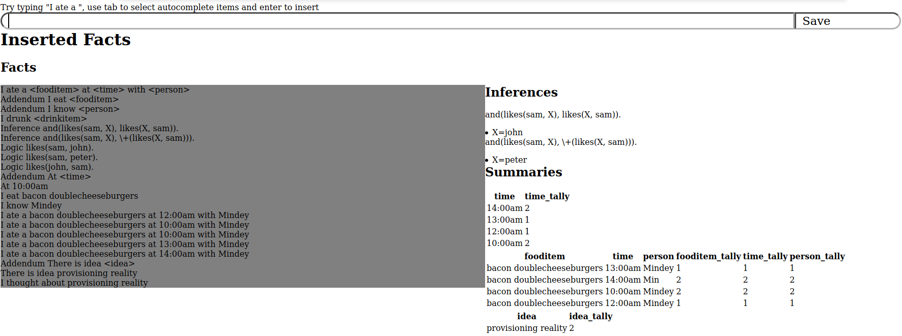

# fact-collector



An interface for collecting facts about yourself, your day or to be used as a microblog. Autocomplete interface powered by Tries. Can insert records that have a fixed format with variables which are parsed to extract fields.

* For example "I ate a <fooditem> at <time> with <person>" has three variables which are stored separately with the fact in the database.
* Type "I ate a"  then use arrow keys to control selected item. Press enter to insert them into textarea.
* When you have fulfilled all variables, press tab and press enter on save.
* Generate summary tables.

* prototype was written on js fiddle -> [Mirrored](https://jsfiddle.net/8nat61g5/13/)

# Prolog inference

The tau interpreter is used to answer questions about logical statements.

* Prolog statements begin with "Logic"
* Prolog queries begin with "Inference"

# Install

Create a postgres database called `forum` with password `forum`:
```
CREATE DATABASE forum;
CREATE USER forum WITH PASSWORD 'forum';
GRANT ALL PRIVILEGES ON DATABASE forum to forum;
```


```
sudo apt install postgresql-server-dev-all python3-dev
virtualenv -p $(which python3) venv
source venv/bin/activate
python3 install.py # once for database population
pip install -r requirements.txt
./fact-collector --database-host localhost --database-user forum --database-password forum --database-name forum
```
Go to http://localhost:5010/
